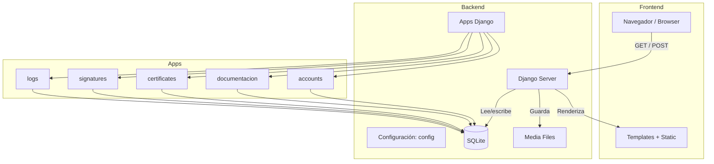

# Arquitectura del Proyecto

```mermaid
graph TD
    subgraph Frontend
        B[Navegador / Browser]
        T[Templates + Static]
    end

    subgraph Backend
        S[Django Server]
        C[Configuración: config]
        A[Apps Django]
        DB[(SQLite)]
        M[Media Files]
    end

    B -->|GET / POST| S
    S -->|Renderiza| T
    S -->|Lee/escribe| DB
    S -->|Guarda| M

    subgraph Apps
        AC[accounts]
        DC[documentacion]
        CF[certificates]
        SG[signatures]
        LG[logs]
    end

    A --> AC
    A --> DC
    A --> CF
    A --> SG
    A --> LG
    AC --> DB
    DC --> DB
    CF --> DB
    SG --> DB
    LG --> DB
```
