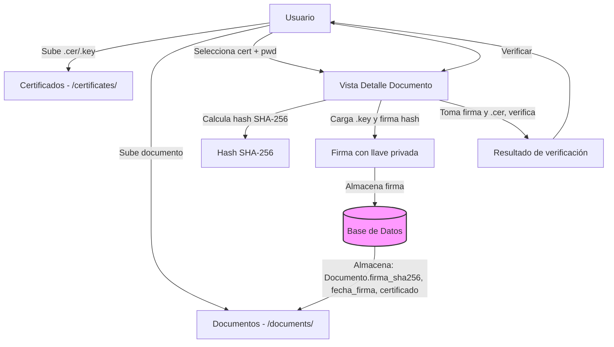
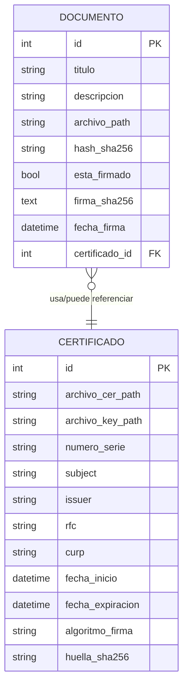
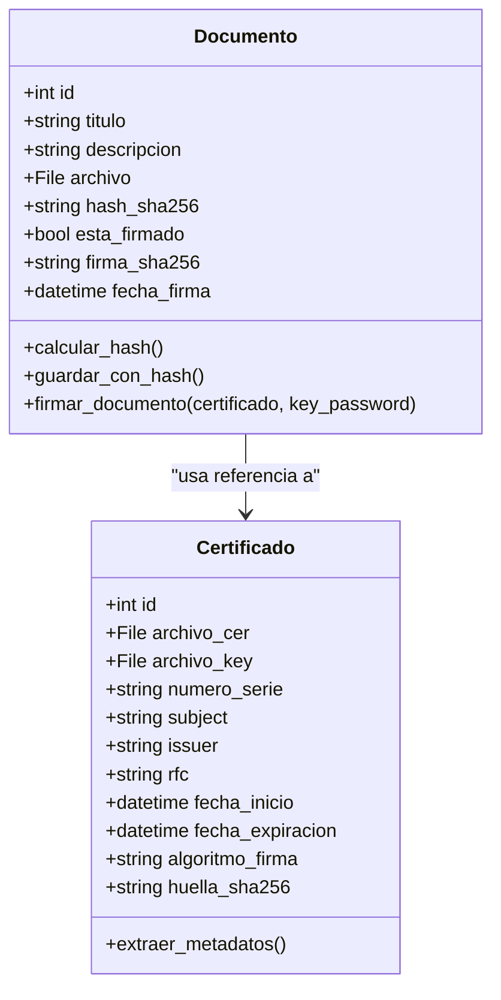

**Diagramas de la feature: Firma Digital**

Archivo con diagramas Mermaid que describen el flujo, las entidades (ER) y el diagrama de clases de la funcionalidad de firma digital.

1) Flujo de la firma (flowchart)

2) Diagrama de Entidades (ER)

3) Diagrama de Clases (simplificado)

4) Notas y uso

- Los diagramas están escritos en Mermaid y se renderizan en muchos visores de Markdown (por ejemplo GitHub, VSCode con extensión Mermaid). Si tu plataforma no renderiza Mermaid, puedes abrir el archivo en VSCode con la extensión "Markdown Preview Enhanced" o usar el live editor de Mermaid (https://mermaid.live).
- Archivos añadidos al repo: `docs/diagrams.md`.

Si quieres, puedo además generar PNG/SVG exportados desde Mermaid y añadirlos a `docs/images/`.
