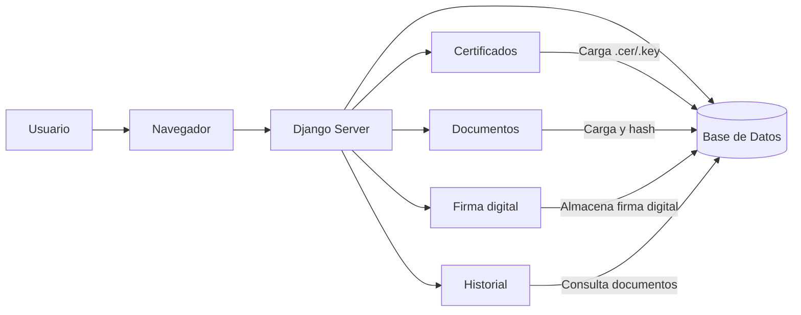

# Diagrama de Componentes

```mermaid
graph LR
    Usuario[Usuario]
    Navegador[Navegador]
    Servidor[Django Server]
    BaseDeDatos[(Base de Datos)]
    Certificados[Certificados]
    Documentos[Documentos]
    Firmas[Firma digital]
    Historial[Historial]

    Usuario --> Navegador
    Navegador --> Servidor
    Servidor --> BaseDeDatos
    Servidor --> Certificados
    Servidor --> Documentos
    Servidor --> Firmas
    Servidor --> Historial

    Certificados -->|Carga .cer/.key| BaseDeDatos
    Documentos -->|Carga y hash| BaseDeDatos
    Firmas -->|Almacena firma digital| BaseDeDatos
    Historial -->|Consulta documentos| BaseDeDatos
```
