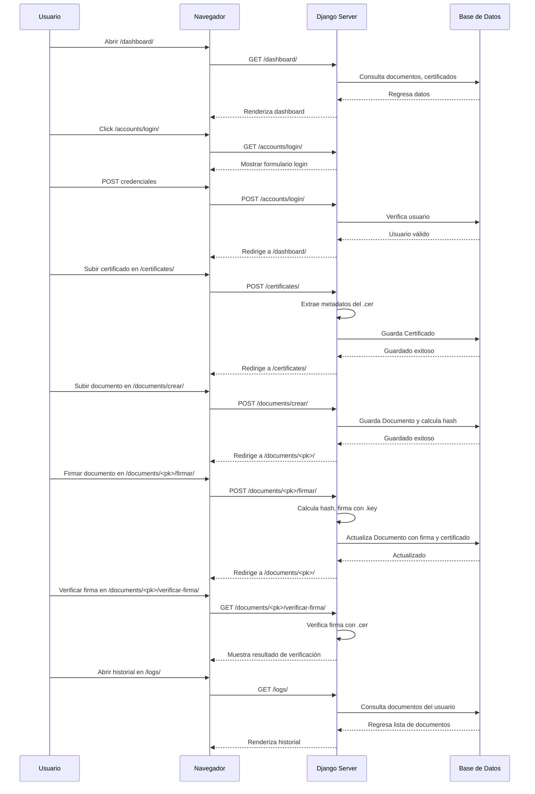

# Diagrama de Secuencia

```mermaid
sequenceDiagram
    participant U as Usuario
    participant B as Navegador
    participant S as Django Server
    participant DB as Base de Datos

    U->>B: Abrir /dashboard/
    B->>S: GET /dashboard/
    S->>DB: Consulta documentos, certificados
    DB-->>S: Regresa datos
    S-->>B: Renderiza dashboard

    U->>B: Click /accounts/login/
    B->>S: GET /accounts/login/
    S-->>B: Mostrar formulario login
    U->>B: POST credenciales
    B->>S: POST /accounts/login/
    S->>DB: Verifica usuario
    DB-->>S: Usuario válido
    S-->>B: Redirige a /dashboard/

    U->>B: Subir certificado en /certificates/
    B->>S: POST /certificates/
    S->>S: Extrae metadatos del .cer
    S->>DB: Guarda Certificado
    DB-->>S: Guardado exitoso
    S-->>B: Redirige a /certificates/

    U->>B: Subir documento en /documents/crear/
    B->>S: POST /documents/crear/
    S->>DB: Guarda Documento y calcula hash
    DB-->>S: Guardado exitoso
    S-->>B: Redirige a /documents/<pk>/

    U->>B: Firmar documento en /documents/<pk>/firmar/
    B->>S: POST /documents/<pk>/firmar/
    S->>S: Calcula hash, firma con .key
    S->>DB: Actualiza Documento con firma y certificado
    DB-->>S: Actualizado
    S-->>B: Redirige a /documents/<pk>/

    U->>B: Verificar firma en /documents/<pk>/verificar-firma/
    B->>S: GET /documents/<pk>/verificar-firma/
    S->>S: Verifica firma con .cer
    S-->>B: Muestra resultado de verificación

    U->>B: Abrir historial en /logs/
    B->>S: GET /logs/
    S->>DB: Consulta documentos del usuario
    DB-->>S: Regresa lista de documentos
    S-->>B: Renderiza historial
```
