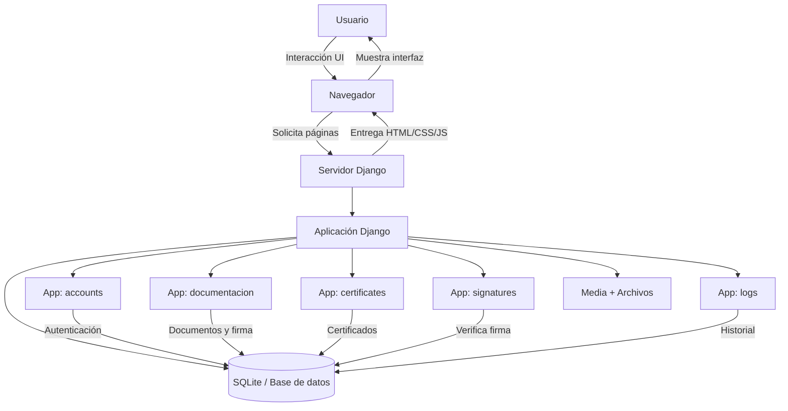

# Diseño del Sistema

```mermaid
flowchart TD
    U[Usuario] -->|Interacción UI| N[Navegador]
    N -->|Solicita páginas| S[Servidor Django]
    S --> A[Aplicación Django]
    A --> C[App: accounts]
    A --> D[App: documentacion]
    A --> F[App: certificates]
    A --> Sg[App: signatures]
    A --> L[App: logs]
    A --> DB[(SQLite / Base de datos)]
    A --> M[Media + Archivos]
    S -->|Entrega HTML/CSS/JS| N
    N -->|Muestra interfaz| U
    C -->|Autenticación| DB
    D -->|Documentos y firma| DB
    F -->|Certificados| DB
    Sg -->|Verifica firma| DB
    L -->|Historial| DB
```
